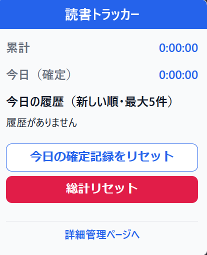
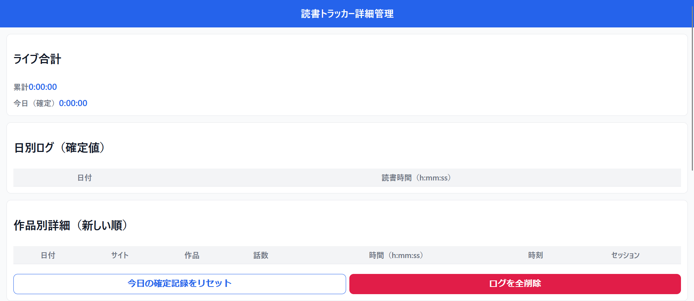

# ブックタイマー

# 概要
Book Timerは原則ローカルで完結する軽量、省機能のFirefox向け拡張機能です。
現在ある機能としては作品ごと、サブタイトルごとに時間を計測し、開いていた時間を可視化する。
などが挙げられます。
対応サイトはPixiv,小説家になろう,カクヨム,ハーメルンとなります。
なお、小説家になろうについては本文の判定用になろうAPIを用いていますが、それ以外の通信は一切ありません。

## 対応サイト
- Pixiv
- 小説家になろう（※サブタイトルはURL番号で代替）
- カクヨム
- ハーメルン  

※「小説家になろう」については本文判定にAPIを利用していますが、それ以外の通信は一切ありません。

## 機能
- 作品ごと・サブタイトルごとの本文読書時間を計測  
- 対応サイトを選択可能  
- ログの全消去  
- 1日単位の統計消去  
- 判定方法は Tabs の Title / URL または API を利用  

## インストール方法
- 通常通りManifestを選択し、インストールしてください。

## ライセンス
ライセンスはMitとなります。

## 最後に
本拡張機能では大部分に生成AIを用いて開発を実施しています。
そのため、一部HTMLなどの表記に揺れが発生しています。
問題点などがあればただちに
shin2222good@gmail.comまで連絡をお願いします。